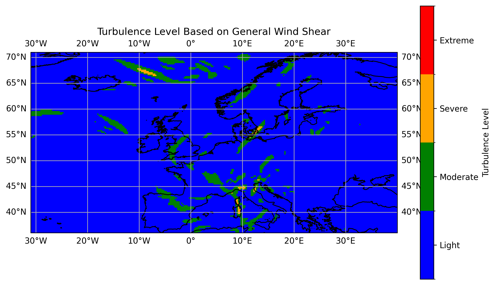
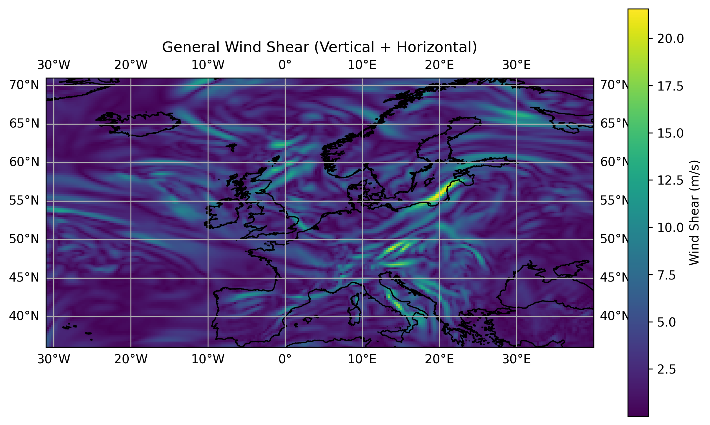
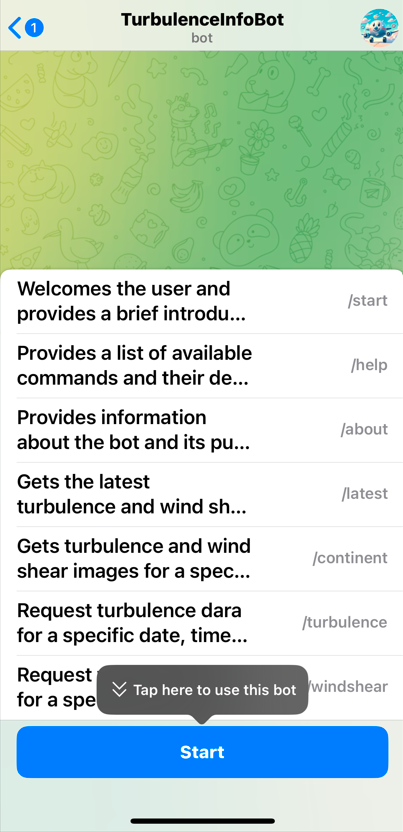
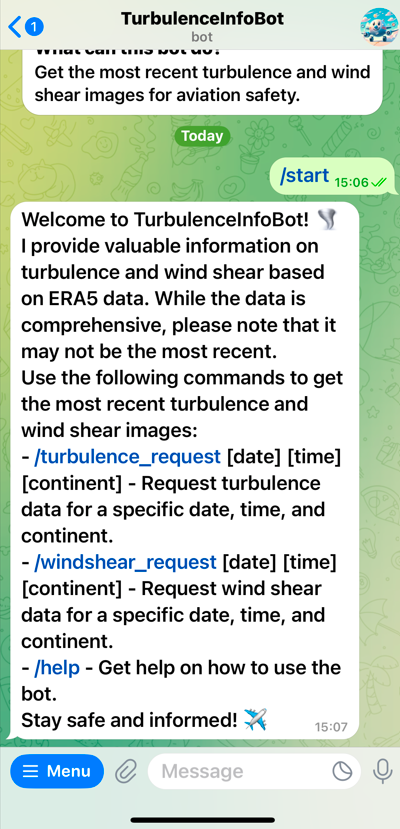
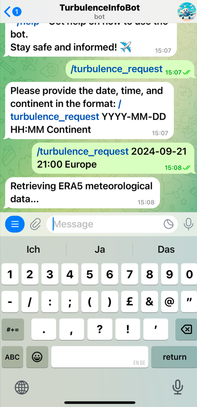
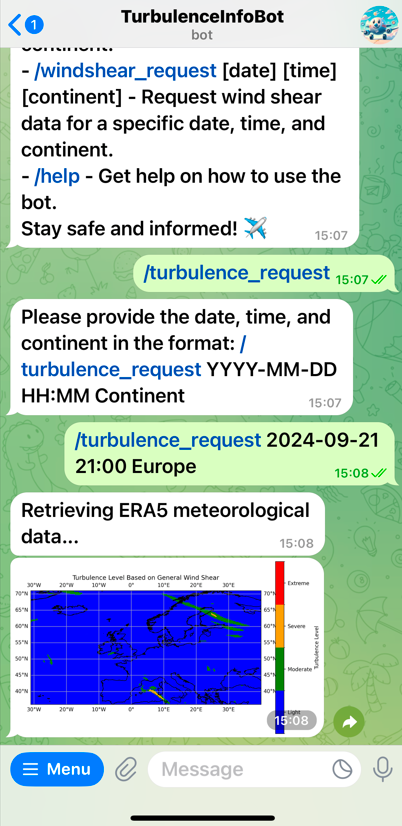
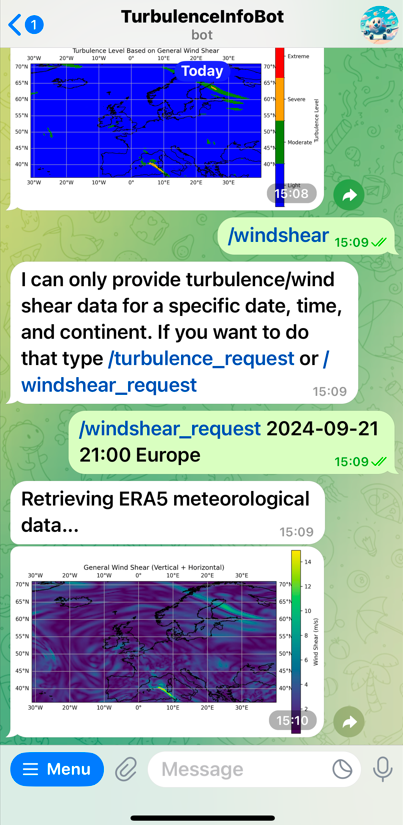
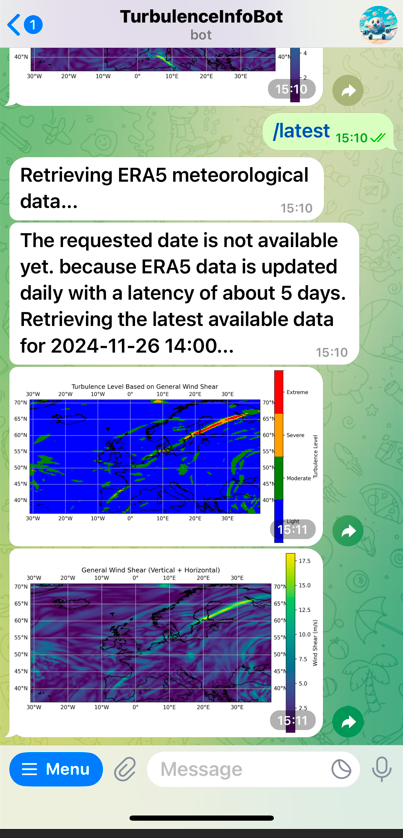
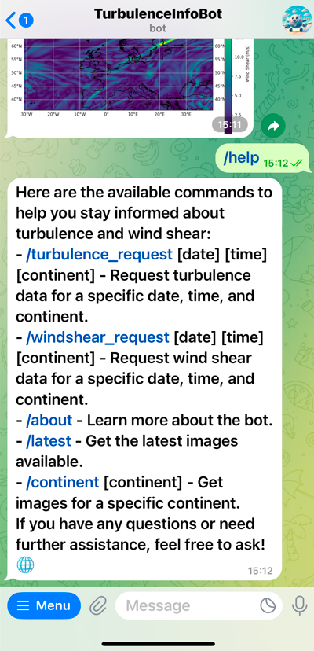
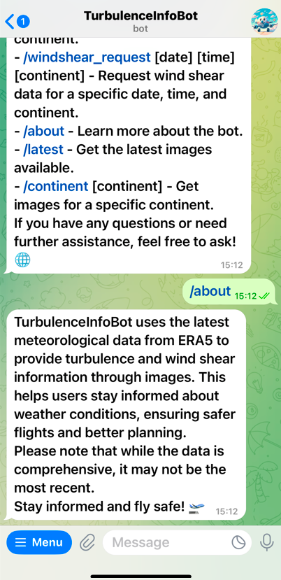

# Turbulence-Info-Bot

TurbulenceInfoBot is a Telegram bot that provides valuable information on turbulence and wind shear based on ERA5 meteorological data. The bot uses the latest meteorological data from ERA5 (with a latency of 5 days) to generate images that help users stay informed about weather conditions, ensuring safer flights and better planning.

## Table of Contents

- [Introduction](#introduction)
- [Features](#features)
- [Installation](#installation)
- [Usage](#usage)
- [Code Structure](#code-structure)
- [Contributing](#contributing)

## Introduction

TurbulenceInfoBot is designed to provide users with up-to-date information on turbulence and wind shear. The bot fetches data from the ERA5 reanalysis dataset and processes it to generate images that visualize wind shear and turbulence levels. Users can request data for specific dates, times, and continents.

## Features

- Fetch and process ERA5 data for wind shear and turbulence.
- Generate and visualize vertical, horizontal, and general wind shear.
- Classify turbulence levels based on wind shear values.
- Provide data for specific continents.
- Integrate with Telegram for easy access to information.

## Installation

1. **Clone the Repository**:

   ```sh
   git clone https://github.com/your-username/TurbulenceInfoBot.git
   cd TurbulenceInfoBot
    
2. **Set Up Environment Variables**:

    Remove the .dev extensions from keys.env.dev and cdsapi.txt.dev.
    
    Fill in the required variables:

        - API key --> cdsapi.txt
        - Telegram name and token --> keys.env

3. **Build and Run the Docker Container**:
    
    ```sh
    docker compose build
    docker compose up

## Usage

**Telegram Commands**:

- /start: Welcome message and introduction to the bot.
- /help: List of available commands.
- /about: Information about the bot.
- /latest: Get the latest turbulence and wind shear images.
- /continent [continent]: Get images for a specific continent.
- /turbulence_request [date] [time] [continent]: Request turbulence data for a specific date, time, and continent.
- /windshear_request [date] [time] [continent]: Request wind shear data for a specific date, time, and continent.

**Example - 1. Turbulence and wind shear images for a specific date and time (Europe)**:

To request turbulence data for November 24, 2024, at 10:00 AM for Europe:

    /turbulence_request 2024-11-24 10:00 Europe



To request wind shear data for November 24, 2024, at 10:00 AM for Europe:

    /windshear_request 2024-11-24 10:00 Europe



**Example - 2. Telegram Bot Experience**:

Below are screenshots showing the user experience with the Telegram bot for each command:

1. ChatBot Start Screen:



2. Start Command:



3. Turbulence Request Command:




4. Wind Shear Request Command:



5. Latest Command:



6. Help Command:



7. About Command:



## Code Structure

**bot.py**:

- Imports and Constants: Import necessary libraries and define constants.
- Data Fetching Functions: Functions to fetch and process wind shear and turbulence data.
- Command Handlers: Functions to handle specific Telegram commands.
- Message Handling: Function to handle incoming messages and provide responses.
- Error Handling: Function to handle errors during bot operation.
- Bot Initialization: Initialize and start the bot.

**main.py**:

- Imports and Constants: Import necessary libraries and define constants.
- Data Downloading: Function to download ERA5 data.
- Wind Shear Calculations: Functions to calculate vertical, horizontal, and general wind shear.
- Turbulence Classification: Function to classify turbulence levels based on wind shear values.
- Plotting Functions: Functions to plot wind shear and turbulence level data.
- Main Function: Orchestrate data downloading, calculations, and plotting.

## Contributing

Contributions are welcome! Please feel free to submit issues and enhancement requests.

